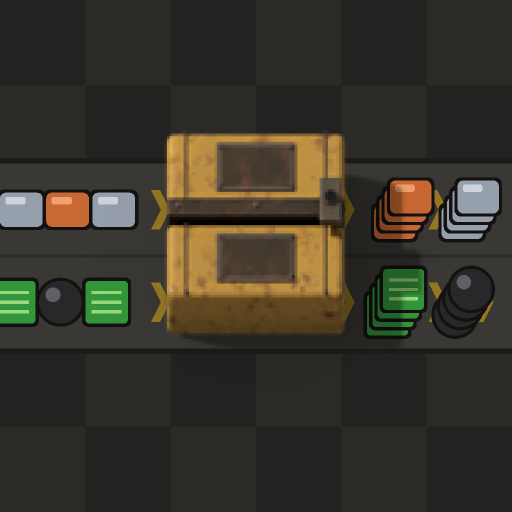

# Sushi Packer

Sushi Packer is a 1×1 inline belt box for mixed item belts. It keeps the two belt lanes separate, gathers each item type until it fills one belt stack (1 item before belt stacking research, then whatever research sets: 4 in vanilla Space Age, more when a mod raises it), then sends that stack forward as one stacked belt item. The box preserves the lane each item entered on.

With belt stacking enabled, hidden inserters move items in and out of the box, so it needs very little script time. Each lane holds 12 slots. Since 0.1.17 the box is a belt piece: belts join it, the game rotates it, and wires work as on a belt. Its own window shows both lanes. Items below one full stack wait in a hidden inserter hand until the stack is complete or the flush timer runs out.

## Tiers and recipes

Each tier matches a belt speed. Recipes are crafted in the crafting category, by hand or in an assembler.

| Tier | Ingredients | Craft time | Unlock |
| --- | --- | ---: | --- |
| Sushi packer | 1 steel chest, 1 splitter, 2 inserters, 5 electronic circuits | 30 s | Sushi packer |
| Fast sushi packer | 1 sushi packer, 1 fast splitter, 2 fast inserters, 5 advanced circuits | 45 s | Fast sushi packer |
| Express sushi packer | 1 fast sushi packer, 1 express splitter, 2 bulk inserters, 5 processing units | 60 s | Express sushi packer |
| Turbo sushi packer | Space Age: 1 express sushi packer, 1 turbo splitter, 2 stack inserters, 2 quantum processors | 120 s | Turbo sushi packer |

## Modded belt tiers

These tiers appear only when the matching belt mod is installed.

| Tier | Belt mod | Speed | Builds |
| --- | --- | ---: | --- |
| Hyper sushi packer | Planetaris: Arig | 75/s | 2.0 + 2.1 |
| Ultimate sushi packer | Bob's Logistics | 75/s | 2.0 + 2.1 |
| Superior sushi packer | Krastorio 2 | 90/s | 2.0 + 2.1 |
| Ultra fast sushi packer | Ultimate Belts Space Age | 90/s | 2.0 |
| Ultra sushi packer | Better Belts | 96/s | 2.0 |
| Extreme fast sushi packer | Ultimate Belts Space Age | 135/s | 2.0 |
| Ultra express sushi packer | Ultimate Belts Space Age | 180/s | 2.0 |
| Extreme express sushi packer | Ultimate Belts Space Age | 225/s | 2.0 |
| Ultimate sushi packer | Ultimate Belts Space Age | 270/s | 2.0 |
| Elite sushi packer | Advanced Belts 2.0 | 60/s | 2.0 |
| Extreme sushi packer | Advanced Belts 2.0 | 75/s | 2.0 |
| Supreme sushi packer | Advanced Belts 2.0 | 90/s | 2.0 |
| Ultimate sushi packer | Advanced Belts 2.0 | 105/s | 2.0 |
| Space sushi packer | Space Exploration | 45/s | 2.0 + 2.1 |
| Deep space sushi packer | Space Exploration | 90/s by default (follows mod setting) | 2.0 + 2.1 |

Space Age is optional. Without it, stacked output needs belt stacking research from Space Age, Stack Inserters, or Infinite Belt Stacking; without that research items pass through one by one. There is no turbo box, and modded tiers chain after blue using 2 bulk inserters and 5 processing units (60 s). With Space Age, modded recipes use 2 stack inserters and 2 quantum processors (120 s), and tiers chain after turbo. Each box runs at its belt's real speed and follows speed changes made by the belt mod's settings. Boxes can be placed on Space Exploration space tiles. Planetaris Hyarion has no belt of its own: the hyper belt comes from Planetaris: Arig, and with Hyarion installed its technology moves into Hyarion's progression, so the packer tier follows it. In Space Exploration the space box starts its own line: it needs no earlier box (1 steel chest, 1 space splitter, 4 bulk inserters, 10 processing units), and the deep space box is made from it. German translation included.

Each box tier unlocks from its matching belt technology and the recipe ingredient technologies. The red, blue, and turbo boxes also require the previous box tier's technology.

## Settings

The map setting **Sushi packer flush timeout** sets the default age, in seconds, at which a partial stack is flushed. Set it to `0` to disable the timeout. Each placed box can use the map default or its own timeout. Boxes also support up to 10 skip filters with a splitter-style quality rule, a circuit enable condition, and a circuit flush signal. A box marked for deconstruction stops. A box can be placed straight over a belt.

## Factorio versions

The source supports two builds: Factorio 2.0 uses mod version `0.1.18`; Factorio 2.1 uses mod version `0.2.18`. Space Age is optional.

## Mod portal assets

`portal/description.md` is the mod portal description. `portal/logo-512.png` and `thumbnail.png` (144×144, shipped in the zip) come from `python3 tools/logo.py`, drawn only from this mod's own box sprite.

## License

MIT — see `LICENSE`.
